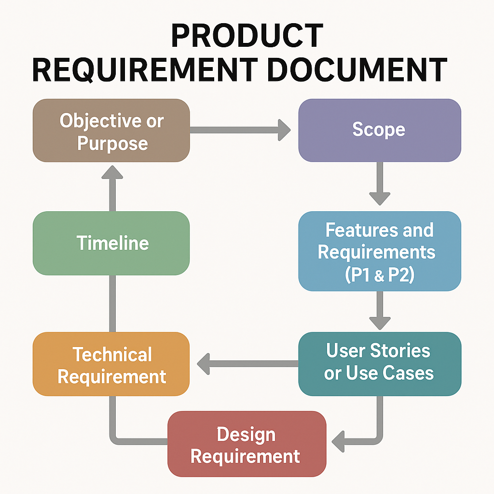

# 📝 PRD (Product Requirement Document) Project

## 📊 PRD Overview Diagram

## 🎯 Objective & Purpose

The objective of this project is to create a structured and detailed **Product Requirement Document (PRD)** that outlines the vision, scope, and technical and design requirements for the product. This PRD serves as a single source of truth for all stakeholders involved in the product development lifecycle.

### Example:
For example, the **PRD for an E-commerce platform** outlines the features like product listings, search functionality, cart system, payment gateway integration, and customer accounts. This PRD helps ensure that the product meets business goals and user needs.

## 📌 Scope

The scope of the PRD includes defining the features, target users, use cases, and necessary requirements to ensure the delivery of a high-quality product. It clearly specifies what is in scope and what is out of scope for this project phase.

### Example:
**In Scope:** 
- User registration and login.
- Adding products to cart.
- Checkout and payment processing.

**Out of Scope:** 
- Vendor-specific features.
- Multi-language support for future releases.

## 🚀 Features and Requirements

### ✅ Priority 1 (P1)
- Core functionality that must be implemented.
- Directly impacts user experience and product goals.

### Example: 
For a **Mobile Banking App**, **P1** features might include:
- Secure login via PIN or biometrics.
- Transaction history view.
- Fund transfers (within the same bank).

### ⏳ Priority 2 (P2)
- Nice-to-have features.
- Can be added in future releases without affecting core usability.

### Example:
In the **Mobile Banking App**, **P2** features might include:
- Bill payment functionality.
- Budget tracking features.
- The ability to add beneficiaries for faster transfers.

## 👥 User Stories / Use Cases

- As a user, I want to **register with my email**, so that I can access the app securely.
- As an admin, I need to **view user activity**, so that I can monitor fraudulent activities.
- As a customer, I want to **view my recent transactions**, so that I can track my spending.

### Example (for a ride-sharing app like Uber):
- **User Story:** As a user, I want to **book a ride** using my current location, so that I can quickly get to my destination without manually entering an address.
- **Use Case:** 
    - **Primary Actor:** Rider.
    - **Precondition:** The user has the app installed and is logged in.
    - **Basic Flow:** The rider opens the app → Selects 'Ride Now' → Confirms pickup location → Driver arrives.
    - **Postcondition:** Rider is picked up and ride is tracked.

## ⚙️ Technical Requirements

- Platform: [Web / Mobile / Desktop]
- Backend: [Node.js, Python, etc.]
- Frontend: [React, Angular, etc.]
- Database: [MongoDB, PostgreSQL, etc.]
- API Protocols: [REST / GraphQL]
- Authentication: [JWT / OAuth2]

### Example:
For a **Food Delivery App**, technical requirements might include:
- **Frontend:** React Native for cross-platform support (iOS and Android).
- **Backend:** Node.js with Express.js for scalable API development.
- **Database:** MongoDB for storing user and restaurant data.

## 🎨 Design Requirements

- Responsive design for mobile and desktop.
- Figma / Adobe XD wireframes to be followed.
- Accessibility compliance (WCAG 2.1 AA).
- Branding (logo, color scheme, typography).

### Example:
For the **Food Delivery App**, the design requirement might specify:
- A **clean, minimalistic design** for the home screen with large, easy-to-read fonts.
- **Clear call-to-action buttons** for ordering food (e.g., “Order Now”).
- Use of **brand colors** in the UI elements: Red and Yellow for energy and appetite stimulation.

## 📅 Timeline

| Phase             | Duration       | Target Dates        |
|------------------|----------------|---------------------|
| Research & Planning | 1 week         | [Start - End Date]   |
| Draft PRD         | 1 week         | [Start - End Date]   |
| Review & Feedback | 3 days         | [Start - End Date]   |
| Finalization      | 2 days         | [Start - End Date]   |
| Handoff           | 1 day          | [Date]               |

### Example Timeline for a **Social Media App**:
| Phase             | Duration       | Target Dates        |
|------------------|----------------|---------------------|
| Market Research  | 2 weeks        | [Start - End Date]   |
| Design & Prototyping | 4 weeks     | [Start - End Date]   |
| Development      | 8 weeks        | [Start - End Date]   |
| Testing & QA     | 3 weeks        | [Start - End Date]   |
| Launch           | 1 week         | [Date]               |

---

📌 **Note:** This document is a living artifact and may be updated as the product evolves.
